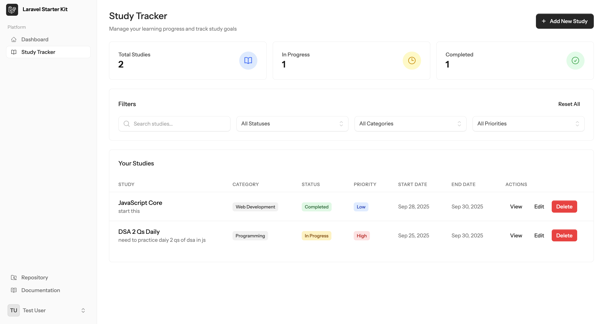

## Practice Laravel 12 LiveWire CRUD

### Introduction
This project is a practice implementation of a CRUD (Create, Read, Update, Delete) application using Laravel 12 and LiveWire. LiveWire is a full-stack framework for Laravel that makes building dynamic interfaces simple, without leaving the comfort of Laravel.


[](https://example.com)

- Traditional Laravel CRUD (MVC) :
```
Routes → Controllers → Models → Views
```

- LiveWire Volt CRUD:
```
Routes → LiveWire Components → Views
```

<br>

### Features
- User authentication
- CRUD operations for a resource (e.g., posts)
- Real-time updates with LiveWire
- Validation and error handling


<br>

<br>

### Prerequisites
- PHP 8.0 or higher
- Composer
- Laravel 12
- LiveWire

<br>

<br>


### Installation
1. Clone the repository
   ```bash
   git clone https://github.com/yourusername/PracticeLivewireCRUD.git
   ```
2. Navigate to the project directory
   ```bash
   cd PracticeLivewireCRUD
   ```
3. Install dependencies
   ```bash
   composer install
   ```
4. Set up your `.env` file
   ```bash
   cp .env.example .env
   ```
5. Generate an application key
   ```bash
   php artisan key:generate
   ```
6. Run migrations
   ```bash
   php artisan migrate
   ```
7. Start the development server
   ```bash
   php artisan serve
   ```

<br>

<br>


### Usage
- Visit `http://localhost:8000` to access the application.
- Use the provided authentication system to log in.
- Perform CRUD operations on the resource.


<br>

<br>

## Folder Structure

### Built In Authentication from Starter Kit

**How This Authentication Works:**

This starter kit uses **Laravel Fortify** with **LiveWire Volt** for authentication. Here's how it works:

- **Laravel Fortify**: Handles the backend authentication logic (login, register, password reset, etc.)
- **LiveWire Volt**: Provides the frontend components using PHP instead of JavaScript
- **Routes**: `routes/auth.php` defines all authentication routes using Volt components
- **Views**: LiveWire components in `resources/views/livewire/auth/` handle the UI
- **Two-Factor Auth**: Built-in support for 2FA with recovery codes

**Login & Signup Process:**
1. User visits `/login` or `/register` routes
2. LiveWire Volt components render the forms (`login.blade.php`, `register.blade.php`)
3. Form submissions are handled by Fortify backend
4. After successful auth, user is redirected to dashboard
5. Settings page allows profile management, password changes, and 2FA setup

**Key Features:**
- Real-time validation without page refreshes
- Email verification support
- Password reset functionality
- Two-factor authentication with recovery codes
- User profile and settings management

**Where Auth Logic is Written:**

1. **Laravel Fortify Package**: Core authentication logic (login, register, password reset)
2. **LiveWire Volt Components**: Auth forms with embedded PHP logic
   - `resources/views/livewire/auth/login.blade.php` - Login form + validation logic
   - `resources/views/livewire/auth/register.blade.php` - Registration form + logic
   - `resources/views/livewire/auth/forgot-password.blade.php` - Password reset request
   - `resources/views/livewire/auth/reset-password.blade.php` - Password reset form
3. **Custom Auth Actions**:
   - `app/Livewire/Actions/Logout.php` - Custom logout logic
4. **Service Provider Configuration**:
   - `app/Providers/FortifyServiceProvider.php` - Fortify setup and customization
5. **Route Definitions**:
   - `routes/auth.php` - All authentication routes using Volt components
6. **Controllers**:
   - `app/Http/Controllers/Auth/VerifyEmailController.php` - Email verification handling

<details>
<summary><strong>Configuration Files</strong></summary>
<br>

```
config/
├── fortify.php
└── auth.php
```

</details>

<details>
<summary><strong>Service Providers</strong></summary>
<br>

```
app/Providers/
├── FortifyServiceProvider.php
└── VoltServiceProvider.php
```

</details>

<details>
<summary><strong>Routes</strong></summary>
<br>

```
routes/
├── auth.php
└── web.php
```

</details>

<details>
<summary><strong>Controllers</strong></summary>
<br>

```
app/Http/Controllers/Auth/
└── VerifyEmailController.php
```

</details>

<details>
<summary><strong>Models</strong></summary>
<br>

```
app/Models/
└── User.php
```

</details>

<details>
<summary><strong>Database Migrations</strong></summary>
<br>

```
database/migrations/
├── 0001_01_01_000000_create_users_table.php
└── 2025_09_02_075243_add_two_factor_columns_to_users_table.php
```

</details>

<details>
<summary><strong>Livewire Auth Views</strong></summary>
<br>

```
resources/views/livewire/auth/
├── login.blade.php
├── register.blade.php
├── forgot-password.blade.php
├── reset-password.blade.php
├── confirm-password.blade.php
├── verify-email.blade.php
└── two-factor-challenge.blade.php
```

</details>

<details>
<summary><strong>Livewire Settings Views</strong></summary>
<br>

```
resources/views/livewire/settings/
├── profile.blade.php
├── password.blade.php
├── two-factor.blade.php
├── delete-user-form.blade.php
├── appearance.blade.php
└── two-factor/
    └── recovery-codes.blade.php
```

</details>

<details>
<summary><strong>Dashboard View</strong></summary>
<br>

```
resources/views/
└── dashboard.blade.php
```

</details>

### CRUD Functionality

```
Routes → Livewire Volt Components → Blade Views
```

**Study Tracker - A Livewire Volt CRUD Application**

This project implements a complete Study Tracker CRUD system to help manage your learning progress. It's a practical example of using Livewire Volt for modern, reactive Laravel apps.


**Key Files for Study CRUD:**

- **Migration:**
   - `database/migrations/xxxx_xx_xx_create_studies_table.php` – Defines the `studies` table structure
- **Model:**
   - `app/Models/Study.php` – Eloquent model for Study, with fillable fields and casts
- **Routes:**
   - `routes/web.php` – Registers all Study CRUD routes
- **Livewire Blade Components (logic & UI together):**
   - `resources/views/livewire/studies/index.blade.php` – Main logic and UI for listing, filtering, deleting studies
   - `resources/views/livewire/studies/create.blade.php` – Logic and UI for creating a new study
   - `resources/views/livewire/studies/edit.blade.php` – Logic and UI for editing a study
   - `resources/views/livewire/studies/show.blade.php` – Study details view (logic and UI)

**Features:**
- ✅ Track what you're studying with detailed information
- ✅ Mark studies as pending, in progress, or completed
- ✅ Categorize studies by subject (Web Dev, Database, etc.)
- ✅ Set priorities and target completion dates
- ✅ Real-time filtering and search without page refreshes
- ✅ User-specific studies (each user sees only their own)

**Database Structure:**
- `studies` table with fields: title, description, category, status, priority, dates
- Relationship: `studies.user_id` → `users.id` (each study belongs to a user)

**CRUD Operations:**
- **Create**: Add new study topics with validation
- **Read**: View all studies in a paginated table with filters
- **Update**: Edit study details and change status
- **Delete**: Remove completed or unwanted studies (with confirmation modal)

**Livewire Blade Components:**
- `index` – Main table view with filtering, search, and delete (logic and UI in one file)
- `create` – Create new study form (logic and UI in one file)
- `edit` – Edit existing study form (logic and UI in one file)
- `show` – Study details (logic and UI in one file)
- `components/confirm-modal` – Reusable modal for delete confirmation

**Progress:**
- ✅ Database migration created
- ✅ Eloquent model with relationships
- ✅ Livewire Volt components for CRUD
- ✅ Routes and validation
- ✅ Filters and search functionality

<br>

<br>

## Additional Technologies & Libraries Included

**CSS Framework & UI Components:**

- **Tailwind CSS v4**: Utility-first CSS framework for styling
- **Flux UI Components**: Pre-built Laravel/LiveWire UI components
  - `<flux:input>` - Form inputs with built-in validation styling
  - `<flux:button>` - Styled buttons with variants
  - `<flux:checkbox>` - Custom checkboxes
  - `<flux:link>` - Styled links with navigation
  - `<flux:heading>` - Typography components
  - `<flux:separator>` - Visual separators

**Frontend Build Tools:**

- **Vite**: Modern build tool for asset compilation
- **Autoprefixer**: Automatic CSS vendor prefixing
- **Axios**: HTTP client for API requests

**Backend Technologies:**

- **Laravel Fortify**: Authentication backend without UI
- **LiveWire Volt**: Single-file components (PHP + HTML in one file)
- **Email Verification**: Built-in email verification system
- **Rate Limiting**: Protection against brute force attacks
- **Session Management**: Secure session handling
- **CSRF Protection**: Cross-site request forgery protection

**Development & Testing:**

- **Database Factories**: User factory for testing/seeding
- **Testing Setup**: PHPUnit and Pest testing frameworks ready
- **Seeders**: Database seeding capabilities
- **Hot Reloading**: Vite development server with hot module replacement
